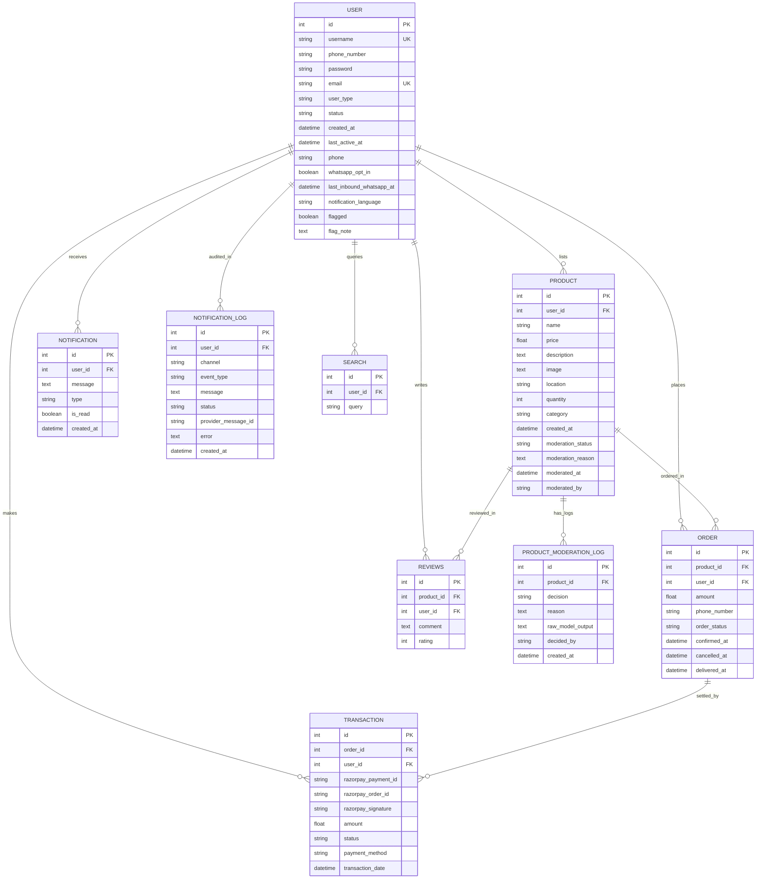

# EcoGreen Database Entity-Relationship Diagram

## Summary of Tables and Relationships

1. **`User` (table: `user`)**: Central table for all users (Farmers, Consumers, Admins). Holds auth credentials, profile data, and notification preferences.
2. **`Product` (table: `product`)**: Agricultural produce listed by Farmers (`user_id`).
3. **`Order` (table: `order`)**: Purchase records created by Consumers (`user_id`) for specific products (`product_id`).
4. **`Transaction` (table: `transaction`)**: Payment gateway records associated with orders and users.
5. **`Notification` (table: `notification`)**: In-app notifications served to users.
6. **`NotificationLog` (table: `notification_log`)**: Outbox log auditing multi-channel dispatch (WhatsApp Cloud API & Brevo SMTP).
7. **`Reviews` (table: `reviews`)**: Ratings and text reviews submitted by consumers for products.
8. **`Search` (table: `search`)**: Query history logged for analytics search trends.
