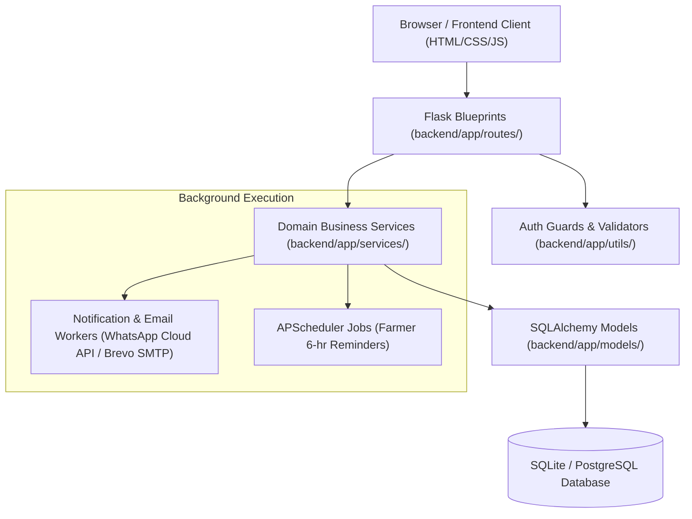

# EcoGreen Platform Architecture

## System Overview & Layered Architecture

EcoGreen follows an industry-standard 4-tier layered architecture:

## Layer Responsibilities

1. **Presentation / Frontend (`frontend/`)**:
   - Split into `templates/` (Jinja2 HTML components) and `static/` (CSS stylesheets and vanilla JavaScript API wrappers).
   - Keeps zero inline styles or scripts to ensure fast client caching and separation of concerns.

2. **Routing / Controllers (`backend/app/routes/`)**:
   - Modular Flask Blueprints per domain (`auth_bp`, `products_bp`, `orders_bp`, `payments_bp`, `notification_bp`, `analytics_bp`, `pages_bp`).
   - Responsible for HTTP request parsing, status code handling, and delegating complex operations to domain services.

3. **Domain Business Logic (`backend/app/services/`)**:
   - Isolated services (`payment_service.py`, `notification_service.py`, `email_service.py`, `order_service.py`, `analytics_service.py`).
   - Enforces business rules, calculates metrics, coordinates external gateway communications (Razorpay, Brevo, Meta WhatsApp), and handles retries.

4. **Data Access & Persistence (`backend/app/models/` & `database/`)**:
   - Declarative SQLAlchemy ORM models mapped 1-to-1 to database tables.
   - Managed via Alembic / Flask-Migrate under `database/migrations/`.

5. **Utilities & Guards (`backend/app/utils/`)**:
   - Authorization decorators (`admin_required`, `farmer_required`), request validators (`normalize_phone`), and formatting helpers.

6. **Application Factory (`backend/app/__init__.py`)**:
   - Centralized `create_app()` instantiates Flask, registers configuration classes, attaches extensions (`db`, `jwt`, `migrate`), and attaches CLI commands.
